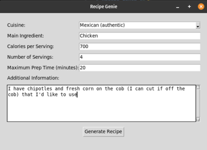
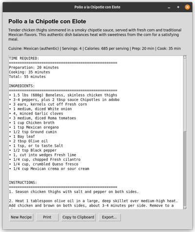

# Recipe Genie 🧞‍♂️👨‍🍳

In a rut? Can't think of something make? Roll the dice with AI.

Recipe Genie is an AI-powered recipe generator that creates personalized recipes based on your preferences. Simply specify your desired cuisine, main ingredient, calorie target, and other parameters, and Recipe Genie will craft a delicious recipe tailored to your needs.



## Features

- **Cuisine Selection**: Choose from a wide variety of global cuisines
- **Ingredient Focus**: Specify the main ingredient you want to use
- **Nutritional Control**: Set calorie targets per serving
- **Time Management**: Specify maximum preparation time
- **Customization**: Add additional requirements or dietary restrictions
- **Export Options**: Print, copy to clipboard, or save recipes as text files
- **Flexible AI Backend**: Works with various LLM providers (OpenAI, Anthropic, local models via Ollama, etc.)



## Requirements

- Python 3.8 or higher
- Internet connection (for cloud-based LLMs) or local LLM setup (e.g., Ollama)
- API key for your chosen LLM provider (if using cloud-based LLMs)

## Installation

### Windows

1. Download or clone this repository
2. Double-click `setup.bat`
3. Follow the on-screen instructions
4. Update `config.json` with your LLM provider details
5. Run `RecipeGenie.bat` to start the application

### macOS/Linux

1. Download or clone this repository
2. Open Terminal in the project directory
3. Run `chmod +x setup.sh && ./setup.sh`
4. Follow the on-screen instructions
5. Update `config.json` with your LLM provider details
6. Run `./run_recipe_genie.sh` to start the application

## Configuration

Recipe Genie supports various LLM providers through the LiteLLM library. Configure your preferred model in the `config.json` file:

### OpenAI Example
```json
{
    "model": "gpt-4",
    "api_key": "your-openai-api-key",
    "litellm_config": {
        "timeout": 60
    }
}
```

### Anthropic Claude Example
```json
{
    "model": "claude-3-sonnet",
    "api_key": "your-anthropic-api-key",
    "litellm_config": {
        "timeout": 60
    }
}
```

### Local Ollama Example
```json
{
    "model": "ollama/llama2",
    "api_key": "",
    "litellm_config": {
        "timeout": 60,
        "api_base": "http://localhost:11434"
    }
}
```

## Usage

1. Select a cuisine from the dropdown or type your own
2. Enter the main ingredient you want to use
3. Specify calories per serving
4. Set the number of servings
5. Enter maximum preparation time in minutes
6. Add any additional information (dietary restrictions, preferences, etc.)
7. Click "Generate Recipe"
8. View, print, copy, or save your personalized recipe

## Supported LLM Providers

Recipe Genie works with any LLM provider supported by LiteLLM, including:

- OpenAI (GPT-3.5, GPT-4)
- Anthropic (Claude models)
- Local models via Ollama
- Azure OpenAI
- Google (Gemini models)
- Cohere
- And many more!

## Troubleshooting

- **API Key Issues**: Ensure your API key is correctly entered in `config.json`
- **Model Not Found**: Verify the model name is correct for your chosen provider
- **Connection Errors**: Check your internet connection or local LLM setup
- **Debug Logs**: Check the `debug_logs` directory for error information

## License

[MIT License](LICENSE)

## Acknowledgments

- Built with LiteLLM for flexible LLM provider support
- Uses Tkinter for the user interface
- Inspired by the joy of cooking and the power of AI
- Mostly written by Anthropic Sonnet (including most this lovely README)
